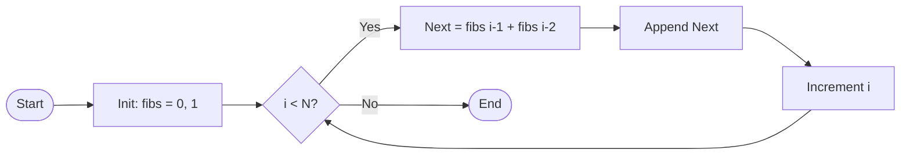
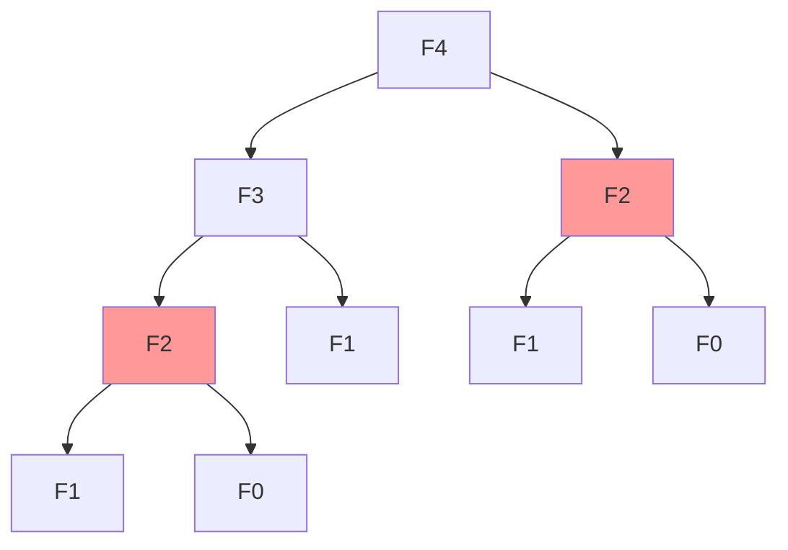
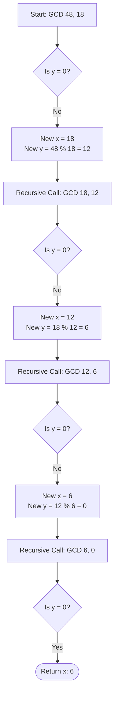
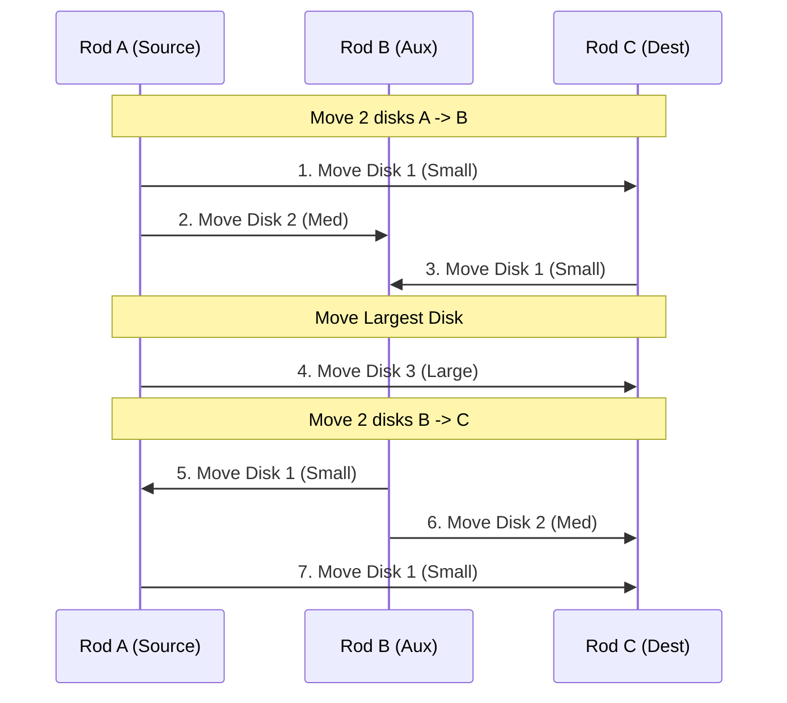

# Algorithms Exam Preparation

This document contains revision material based on Week 1 lectures, the Mock Exam, and Sample Questions. It includes algorithms, code implementations (Python), and answers to theoretical questions.

---

## Part 1: Core Algorithms (Task 1, 2, 3)

### Task 1: Iterative Fibonacci Sequence
**Problem:** Input an integer $N$. Output the first $N$ Fibonacci numbers.
*Definition:* $F(0)=0, F(1)=1, F(n) = F(n-1) + F(n-2)$

#### Algorithm (Pseudocode)
```text
Algorithm IterativeFibonacci(N)
    Input: Integer N
    Output: List of first N Fibonacci numbers
    
    if N < 1 return empty list
    if N == 1 return [0]
    
    fib_list = [0, 1]
    
    for i from 2 to N-1:
        next_fib = fib_list[i-1] + fib_list[i-2]
        append next_fib to fib_list
        
    return fib_list
```

#### Python Implementation
```python
def iterative_fibonacci(n):
    if n <= 0:
        return []
    elif n == 1:
        return [0]
    
    fibs = [0, 1]
    for _ in range(2, n):
        next_val = fibs[-1] + fibs[-2]
        fibs.append(next_val)
    return fibs

# Example
N = 10
print(f"First {N} Fibonacci numbers: {iterative_fibonacci(N)}")
```

#### Visualizing Fibonacci
**Iterative Process Flow:**


**Recursive Complexity (Why Iterative?):**
Recursive Fibonacci `Fib(n)` recalculates the same values multiple times.

*Note: `F2` is calculated twice even for small N=4. This redundancy grows exponentially.*

---

### Task 2: Recursive Greatest Common Divisor (GCD)
**Problem:** Input two integers $x$ and $y$. Output their GCD.
*Based on Euclidean Algorithm:* $GCD(x, y) = GCD(y, x \pmod y)$ where $GCD(x, 0) = x$.

#### Algorithm (Pseudocode)
```text
Algorithm RecursiveGCD(x, y)
    Input: Integers x, y
    Output: GCD of x and y (Integer)
    
    if y == 0:
        return x
    else:
        return RecursiveGCD(y, x mod y)
```

#### Python Implementation
```python
def recursive_gcd(x, y):
    if y == 0:
        return x
    return recursive_gcd(y, x % y)

# Example
x, y = 48, 18
print(f"GCD of {x} and {y} is: {recursive_gcd(x, y)}")
```

#### Visualizing Euclidean Algorithm
Logic: $GCD(48, 18) \to GCD(18, 12) \to GCD(12, 6) \to GCD(6, 0) \to 6$



---

### Task 3: Recursive Tower of Hanoi
**Problem:** Move $N$ disks from Source rod to Destination rod using an Intermediate rod.
*Rules:* Move one disk at a time; never place a larger disk on a smaller one.

#### Algorithm (Pseudocode)
```text
Algorithm TowerOfHanoi(n, source, destination, auxiliary)
    Input: n (disks), source, destination, auxiliary (rod names)
    
    if n == 1:
        print "Move disk 1 from", source, "to", destination
        return
        
    # Move n-1 disks from source to auxiliary
    TowerOfHanoi(n-1, source, auxiliary, destination)
    
    print "Move disk", n, "from", source, "to", destination
    
    # Move n-1 disks from auxiliary to destination
    TowerOfHanoi(n-1, auxiliary, destination, source)
```

#### Python Implementation
```python
def tower_of_hanoi(n, source, destination, auxiliary):
    if n == 1:
        print(f"Move disk 1 from {source} to {destination}")
        return
    
    # Move n-1 disks from source to auxiliary
    tower_of_hanoi(n-1, source, auxiliary, destination)
    
    # Move nth disk from source to destination
    print(f"Move disk {n} from {source} to {destination}")
    
    # Move n-1 disks from auxiliary to destination
    tower_of_hanoi(n-1, auxiliary, destination, source)

# Example for N=3
print("Tower of Hanoi (3 disks):")
tower_of_hanoi(3, 'A', 'C', 'B')
```
*Note on Complexity:* The number of moves is $2^N - 1$. Time complexity is $O(2^N)$.

#### Visualizing Tower of Hanoi (3 Disks)
Goal: Move stack from **A** to **C**.
1. Move 2 disks A $\to$ B (Auxiliary).
2. Move largest disk A $\to$ C.
3. Move 2 disks B $\to$ C.



---

## Part 2: Mock Exam Questions & Answers

### Q1: Graph Node with Maximum Incoming Edges
**Question:** Write an algorithm to find the node(s) with the maximum number of incoming edges in a directed graph. Output all such nodes if multiple exist.
**Input:** Set of Nodes $V$, Set of Edges $E$ (as pairs $(K, L)$ meaning $K \to L$).

**Answer:**
1.  Initialize a dictionary/map `in_degree` for all nodes with value 0.
2.  Iterate through every edge $(u, v)$ in $E$.
3.  For each edge, increment `in_degree[v]`.
4.  Find the maximum value `max_d` in the `in_degree` map.
5.  Iterate through the `in_degree` map and collect all nodes where `degree == max_d`.
6.  Return the collected nodes.

**Complexity:** $O(|V| + |E|)$ because we iterate edges once and nodes once.

### Q2: A* vs Dijkstra
**Question:** Explain why A* algorithm is faster than Dijkstra's algorithm to compute the shortest path to a node.
**Answer:**
A* uses a **heuristic function** $h(n)$ that estimates the cost from the current node to the target. While Dijkstra explores nodes uniformly in all directions (like an expanding circle) based only on distance from start $g(n)$, A* prioritizes nodes that are likely closer to the goal (minimizing $f(n) = g(n) + h(n)$). This "directed" search allows A* to visit fewer nodes before finding the target, provided the heuristic is admissible.

### Q3: Search Complexity
**Question:** State Best/Worst for Linear Search and Binary Search.
**Answer:**
*   **Linear Search:**
    *   Best Case: $O(1)$ (Element is first)
    *   Worst Case: $O(n)$ (Element is last or not found)
*   **Binary Search (Sorted Array):**
    *   Best Case: $O(1)$ (Element is at middle)
    *   Worst Case: $O(\log n)$ (Element not found or deep in tree)

### Q4: BST Search Complexity
**Question:** State Best/Average/Worst complexity of Search over a Binary Search Tree (BST).
**Answer:**
*   Best Case: $O(1)$ (Root is the target)
*   Average Case: $O(\log n)$ (Tree is balanced)
*   Worst Case: $O(n)$ (Tree is skewed/degenerate, linked list shape)

### Q5: Sorting Complexity
**Question:** State Best, Average, Worst complexity of Insertion Sort. Briefly explain best/worst situations.
**Answer:**
*   **Best Case:** $O(n)$. Occurs when the array is **already sorted**. The inner loop never shifts elements.
*   **Average Case:** $O(n^2)$.
*   **Worst Case:** $O(n^2)$. Occurs when the array is **sorted in reverse order**. Every insertion requires shifting all sorted elements.

### Q6: Tree Definitions
**Question:** Explain the difference between Binary Tree, Binary Search Tree, and AVL Tree.
**Answer:**
*   **Binary Tree:** A tree where every node has at most 2 children. No sorting constraint.
*   **Binary Search Tree (BST):** A binary tree where for every node, the left child is smaller and the right child is greater.
*   **AVL Tree:** A self-balancing BST. It maintains the BST property AND ensures the height difference (balance factor) between left and right subtrees of any node is at most 1, guaranteeing $O(\log n)$ operations.

### Q7: DFS Traversal Code (Fill in the blank)
**Question:** Fill in algorithm for DFS post-order.
```text
Algorithm DFS_postOrder
    Input: root node
    if(node == null) return;
    DFS_postOrder(node.left);   <-- Filled
    DFS_postOrder(node.right);  <-- Filled
    visit(node);                <-- Filled (Post-order: Left, Right, Root)
```

---

## Part 3: Sample Questions (Concepts)

**True (Correct) Statements:**
*   Stacks have 1 end (LIFO) but queues have 2 ends (FIFO). [Correct]
*   Search over a Binary Search Tree is faster than linear search (on average). [Correct]

**False (Incorrect) Statements explanations:**
*   "Higher efficiency means lower computation time" -> *Generally true, but rigor requires "fewer steps". Hardware affects time.*
*   "Running time is measured in seconds" -> *False, usually measured in operations/steps (Big O).*
*   "Binary search does not require input data to be sorted" -> *False, it MUST be sorted.*
*   "Stacks cannot be implemented using ordinary arrays" -> *False, they can be.*
*   "Elements of a linked list do not have to be at consecutive memory location" -> *This statement is actually **TRUE** (Likely marked 'Correct' in context of 'which is correct', but check question phrasing carefully).*
*   "Graphs do not have a root node" -> *True (Generic graphs don't, Trees do).*

**Additional Lecture Questions (Week 1):**
1.  **What is an algorithm?** A well-defined computational procedure that takes input and produces output, halting in finite time.
2.  **Difference between Algorithm and Program?** An algorithm is the abstract logic/steps; a program is the implementation in a specific language.
3.  **Tower of Hanoi Moves:** For $N$ disks, Moves $= 2^N - 1$.
    *   $N=3$: 7 moves.
    *   $N=4$: 15 moves.
    *   $N=5$: 31 moves.
