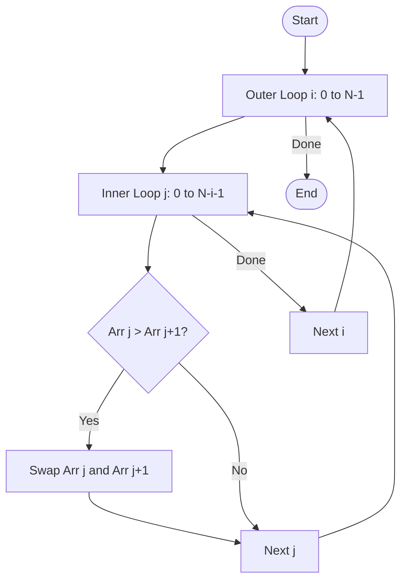
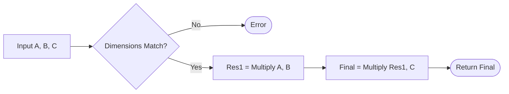

# Week 2: Fundamental Data Structures & Matrices

This document contains revision material based on Week 2 lectures (Data Structures, ADTs) and the provided seminar/lab tasks (Arrays, Sorting, Matrices).

---

## Part 1: Lecture Concepts (Data Structures & ADTs)

### 1. Algorithm vs Data Structure
*   **Algorithm:** A well-defined computational procedure (Logic).
*   **Data Structure:** A specialized format for organizing and storing data (Organization).
*   **Equation:** `Programs = Algorithms + Data Structures`

### 2. Abstract Data Types (ADT)
An ADT defines the **logical behavior** (values and operations) but not the implementation.
*   **Examples:**
    *   **List:** Ordered sequence. Operations: `get`, `insert`, `remove`.
    *   **Stack (LIFO):** Last-In, First-Out. Operations: `push`, `pop`.
    *   **Queue (FIFO):** First-In, First-Out. Operations: `enqueue`, `dequeue`.

### 3. Taxonomy
*   **Primitive:** Integer, Boolean, Char, Double.
*   **Non-Primitive:**
    *   **Linear:** Array, Stack, Queue, Linked List.
    *   **Non-Linear:** Tree, Graph, Hash Table.

---

## Part 2: Seminar Algorithms (Arrays & Lists)

### Task 1: Find Max and Min in an Array
**Problem:** Find the maximum and minimum values in a numerical array.

#### Algorithm
```text
Algorithm FindMaxMin(Arr)
    Input: Array Arr of size N
    Output: Max, Min
    
    if N == 0 return Error
    
    currentMax = Arr[0]
    currentMin = Arr[0]
    
    for k from 1 to N-1:
        if Arr[k] > currentMax:
            currentMax = Arr[k]
        if Arr[k] < currentMin:
            currentMin = Arr[k]
            
    return currentMax, currentMin
```
*Complexity:* $O(N)$

### Task 2: Sort Elements (Bubble Sort)
**Problem:** Sort elements of a numerical list.
**Method:** Bubble Sort (Simple comparison-based sort).

#### Visual Flow

*Complexity:* $O(N^2)$

### Task 3: Shift Zeros to Left
**Problem:** Create a new list from a given list, shifting all zeros to the left.
**Example:** `[1, 0, 2, 0, 3]` $\to$ `[0, 0, 1, 2, 3]`

#### Algorithm (Two-Pass / Construction)
1.  **Count** the zeros.
2.  **Fill** the result with that many zeros first.
3.  **Append** the non-zero elements.

```python
def shift_zeros_left(arr):
    zeros = [x for x in arr if x == 0]
    non_zeros = [x for x in arr if x != 0]
    return zeros + non_zeros
```

---

## Part 3: Matrix Operations (Lab Tasks)

### Matrix Basics
A Matrix is a 2D array (rows $\times$ columns).
*   **Addition/Subtraction:** Element-wise. Dimensions must match exactly.
*   **Multiplication:** $A (m \times n) \times B (n \times p) = C (m \times p)$.
    *   $C_{ij} = \sum (A_{ik} \times B_{kj})$

### Task 1: Multiply Three Matrices (A * B * C)
**Associativity:** Matrix multiplication is associative. $(AB)C = A(BC)$.
**Algorithm:**
1.  Verify dimensions:
    *   $A: m \times n$
    *   $B: n \times p$
    *   $C: p \times q$
2.  Compute $Temp = A \times B$ -> Result is $m \times p$.
3.  Compute $Final = Temp \times C$ -> Result is $m \times q$.



### Task 2: Matrix Calculator Design
**Requirements:** Add, Subtract, Multiply with a Menu.

#### Menu Structure
1.  Enter dimensions & values for Matrix A.
2.  Enter dimensions & values for Matrix B.
3.  **Menu:**
    *   1: Add (A + B)
    *   2: Subtract (A - B)
    *   3: Multiply (A * B)
    *   4: New Matrices
    *   5: Quit

#### Code Implementation
See `matrix_calculator.py` in this folder for the full implementation.
