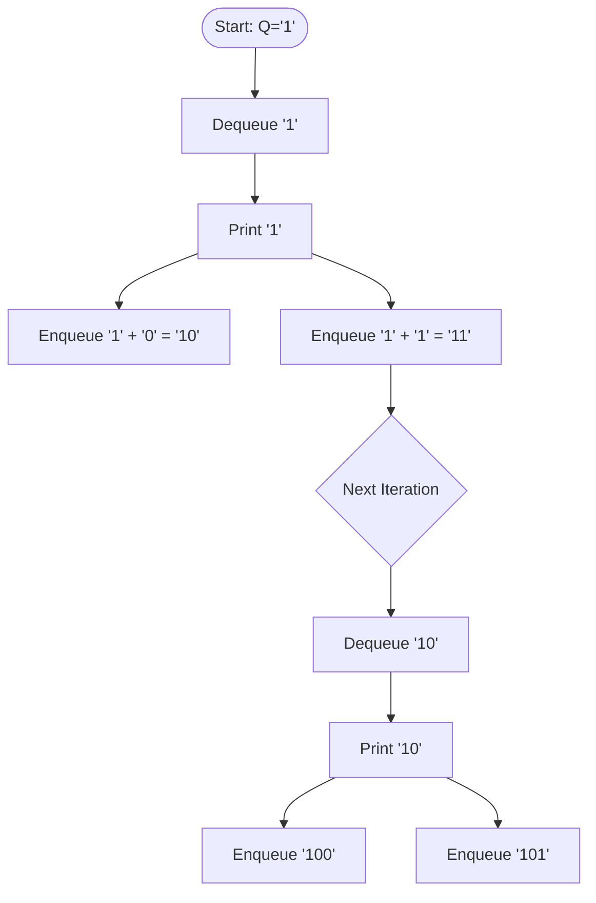
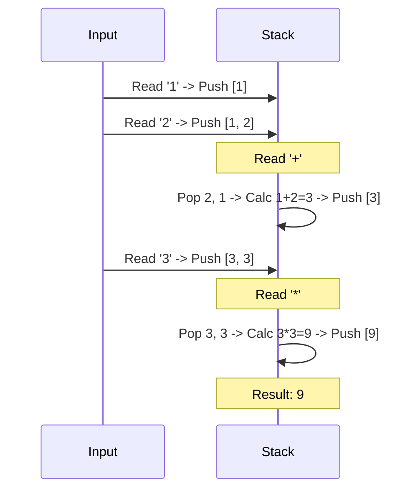

# Week 3: Fundamental Data Structures II

This document contains revision material based on Week 3 lectures (Linked Lists, Stacks, Queues) and the provided seminar/lab tasks (Binary Conversion, Priority Queue, Postfix Calculator).

---

## Part 1: Lecture Concepts (Linear Structures)

### 1. Linked List
*   **Definition:** A linear collection of data elements where order is not given by physical placement in memory. Each element points to the next.
*   **Structure:** `Node { data, next_pointer }`
*   **Complexity:**
    *   Add: $O(1)$
    *   Delete: $O(n)$ (Finding the node takes time)
    *   Search: $O(n)$

### 2. Stack (LIFO - Last In First Out)
*   **Analogy:** Trays in a canteen, Undo/Redo.
*   **Operations:** `push()`, `pop()`.
*   **Implementation:** Can be array-based or linked-list based.
*   **Complexity:** Push/Pop $O(1)$. Search $O(n)$.

### 3. Queue (FIFO - First In First Out)
*   **Analogy:** Ticket counter line.
*   **Operations:** `enqueue()`, `dequeue()`.
*   **Complexity:** Enqueue/Dequeue $O(1)$. Search $O(n)$.

---

## Part 2: Seminar Tasks (Queues & Binary)

### Task 1: Decimal to Binary (Queue)
**Problem:** Generate binary numbers from 1 to N using a Queue.
**Logic:**
1.  Start with queue `Q = ["1"]`
2.  Dequeue `front` (say "1"). **Print it.**
3.  Append "0" to `front` $\to$ "10". Enqueue "10".
4.  Append "1" to `front` $\to$ "11". Enqueue "11".
5.  Repeat.

#### Visual Flow

---

## Part 3: Lab Tasks (Priority Queue & Postfix)

### Task 1: Priority Queue
**Definition:** Elements are popped based on priority (e.g., sorted order), not just insertion order.
**Example:** `['r', 'y', 'd', 'a', 'h']` $\to$ Pop order: `'a'`, `'d'`, `'h'`, `'r'`, `'y'` (Alphabetical).
**Implementation:** A list that sorts itself after insertion, or searching for min/max upon removal.

### Task 2: Postfix Calculator (Stack)
**Infix:** `4 + 7`
**Postfix (Reverse Polish):** `4 7 +`
**Logic:**
1.  Iterate through tokens.
2.  **Number:** Push to Stack.
3.  **Operator:** Pop 2 numbers, apply operator, Push result.

#### Example: `1 2 + 3 *`

---

## Part 4: Code Implementation

See the Python files in this folder for full implementations:
*   `binary_queue.py`: Decimal to Binary converter using standard Queue.
*   `priority_queue.py`: Priority Queue implementation.
*   `postfix_calculator.py`: Postfix calculator using Stack.
